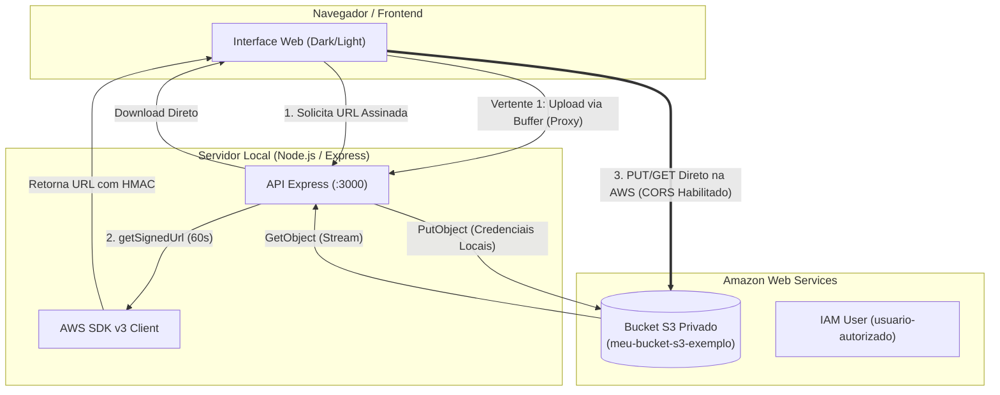

# ☁️ AWS S3 Presigned Portal

[](https://www.terraform.io/)
[](https://aws.amazon.com/s3/)
[](https://nodejs.org/)
[](https://expressjs.com/)
[](https://docs.aws.amazon.com/AWSJavaScriptSDK/v3/latest/)

Solução completa de armazenamento em nuvem que integra **Infraestrutura como Código (Terraform)** seguindo as melhores práticas de mercado (CIS Benchmark, FinOps e TLS Mandatório) com um **Portal Web (Node.js + Frontend Moderno)** para transferência de arquivos via streaming e URLs Pré-assinadas temporárias (60 segundos).

---

## 📐 Arquitetura da Solução



---

## 📁 Estrutura do Repositório

```text
aws-infra/
├── 📁 terraform/                     # 🏗️ Infraestrutura como Código (IaC)
│   ├── main-bucket.tf               # Definição do Bucket, Políticas, FinOps e CORS
│   ├── .terraform.lock.hcl          # Lock de provedores HashiCorp
│   └── terraform.tfstate            # Estado do provisionamento AWS
│
├── 📁 web/                           # 🌐 Aplicação Web (Node.js + Frontend)
│   ├── server.js                    # Servidor Express com AWS SDK v3
│   ├── package.json                 # Manifesto de dependências e scripts
│   ├── package-lock.json
│   └── 📁 public/                   # Frontend estático desacoplado (Clean Architecture)
│       ├── index.html               # Marcação semântica HTML5 pura e acessível
│       ├── style.css                # Design System com tokens (Modos Dark & Light)
│       └── app.js                   # Lógica assíncrona modular e sanitização anti-XSS
│
├── .gitignore                       # Proteção de credenciais, estados e dependências
└── README.md                        # Documentação técnica do projeto
```

---

## 🏗️ 1. Infraestrutura (Terraform)

O módulo Terraform provisiona um bucket S3 robusto, seguro e com otimização de custos:

### 🛡️ Práticas de Segurança e Conformidade
- **Acesso Público Bloqueado:** Bloqueio irrestrito de ACLs e políticas públicas (`aws_s3_bucket_public_access_block`).
- **Bucket Owner Enforced:** ACLs legadas desativadas em prol de políticas IAM (`aws_s3_bucket_ownership_controls`).
- **TLS 1.2+ Mandatório:** Nega explicitamente conexões HTTP sem criptografia (`aws:SecureTransport = false`).
- **Acesso Exclusivo IAM:** Restrito ao usuário autorizado (`arn:aws:iam::<ACCOUNT_ID>:user/<USUARIO>`) com proteção contra lockout para o executor do Terraform e conta root.
- **Criptografia SSE-S3:** Criptografia padrão em repouso com `AES256` e **Bucket Key** ativada para redução de custos de chamadas KMS.
- **Regras de CORS:** Configuração para viabilizar uploads diretos via browser com Presigned URLs.

### 💰 Gestão de Custos (FinOps)
- **Lifecycle Configuration:** Cancela automaticamente multipart uploads incompletos após 7 dias.
- **Expiração de Versões Não-Atuais:** Versões antigas de arquivos versionados são limpas após 90 dias (configurável).

### 🚀 Comandos do Terraform

```powershell
# 1. Navegue até o diretório de infraestrutura
cd terraform

# 2. Inicialize os provedores
terraform init

# 3. Planeje a execução
terraform plan

# 4. Aplique a infraestrutura
terraform apply
```

---

## 🌐 2. Aplicação Web (Presigned Portal)

Uma interface limpa e intuitiva que oferece **duas formas distintas** de manipulação de arquivos:

### ⚡ Comparativo das Vertentes

| Recurso | 💻 Vertente 1: Via Servidor | ⚡ Vertente 2: Presigned URL |
| :--- | :--- | :--- |
| **Fluxo** | Cliente ➔ Servidor Express ➔ AWS S3 | Cliente ➔ AWS S3 (Direto) |
| **Consumo de Banda** | Utiliza a banda do servidor local | Utiliza diretamente a nuvem da AWS |
| **Validade do Link** | Sem link público (upload direto na sessão) | **60 segundos** (expiração automática) |
| **Necessidade de CORS** | ❌ Não requer CORS | ✅ Requer regras de CORS no S3 |
| **Uso Recomendado** | Arquivos pequenos e operações internas | Arquivos pesados ou compartilhamento externo |

---

### 💻 Como Rodar a Aplicação

#### Pré-requisitos
- **Node.js** v18+ instalado.
- Credenciais AWS configuradas na máquina (`~/.aws/credentials` ou variáveis de ambiente).

#### Passo a Passo
```powershell
# 1. Acesse o diretório da aplicação web
cd web

# 2. Instale as dependências
npm install

# 3. Inicie o servidor
npm start
```

Acesse no seu navegador: **[http://localhost:3000](http://localhost:3000)**

---

### 📡 Endpoints da API REST

| Método | Endpoint | Descrição |
| :--- | :--- | :--- |
| `GET` | `/api/files` | Lista todos os arquivos presentes no bucket com metadados (tamanho, data). |
| `POST` | `/api/upload` | Upload tradicional via buffer/stream pelo servidor. |
| `GET` | `/api/download/:key` | Download direto intermediado pelo servidor com headers de anexo. |
| `POST` | `/api/presigned/upload` | Gera uma URL pré-assinada (`PUT`) válida por **60s** para upload direto no S3. |
| `GET` | `/api/presigned/download/:key`| Gera uma URL pré-assinada (`GET`) válida por **60s** para download direto do S3. |
| `DELETE`| `/api/files/:key` | Remove o arquivo selecionado do bucket S3. |

---

### 🎨 Recursos do Frontend

1. **Temas Dark & Light:**
   - Alternância rápida com um clique no topo da página.
   - Salvo automaticamente no `localStorage` do navegador para manter a preferência do usuário.
   - Prevenção de FOUC (*Flash of Unstyled Content*) antes da renderização.

2. **Segurança Anti-XSS (OWASP):**
   - Renderização segura de nomes de arquivos via nós do DOM (`createElement` / `textContent`), impedindo injeções maliciosas.

3. **Acessibilidade Completa (WAI-ARIA & a11y):**
   - Dropzone navegável via teclado (`Tab`, `Enter`, `Espaço`).
   - Diálogo nativo HTML5 (`<dialog>`) com gerenciamento de foco para exibição dos links pré-assinados.
   - Regiões vivas (`aria-live="polite"`) para notificações toast dinâmicas.

---

## ⚙️ Variáveis de Ambiente (Opcional)

No arquivo `web/server.js`, os seguintes parâmetros podem ser configurados via variáveis de ambiente:

| Variável | Padrão | Descrição |
| :--- | :--- | :--- |
| `PORT` | `3000` | Porta onde o servidor Express escuta. |
| `BUCKET_NAME` | `meu-bucket-s3-exemplo` | Nome do bucket S3 de destino na AWS. |
| `AWS_REGION` | `us-east-1` | Região AWS do bucket. |

Exemplo de execução personalizada no PowerShell:
```powershell
$env:PORT="8080"; $env:BUCKET_NAME="outro-bucket"; npm start
```

---

## 🔍 Solução de Problemas (Troubleshooting)

### 1. `Erro de CORS no Upload com Presigned URL`
- **Causa:** O bucket S3 não possui as regras de CORS aplicadas.
- **Solução:** Certifique-se de aplicar o bloco `aws_s3_bucket_cors_configuration` em `terraform/main-bucket.tf` via `terraform apply`.

### 2. `SignatureDoesNotMatch (HTTP 403)`
- **Causa:** A URL pré-assinada ultrapassou o tempo limite de validade de **60 segundos** ou o `Content-Type` enviado pelo cliente é diferente do assinado.
- **Solução:** Gere uma nova URL na interface e execute o envio dentro de 1 minuto.

### 3. `Access Denied no Terraform Apply`
- **Causa:** O usuário executando o Terraform não possui o ARN autorizado na política do bucket.
- **Solução:** O script utiliza `data.aws_caller_identity.current` dinamicamente para garantir que o usuário que executa o Terraform nunca seja bloqueado pela política de negação.
